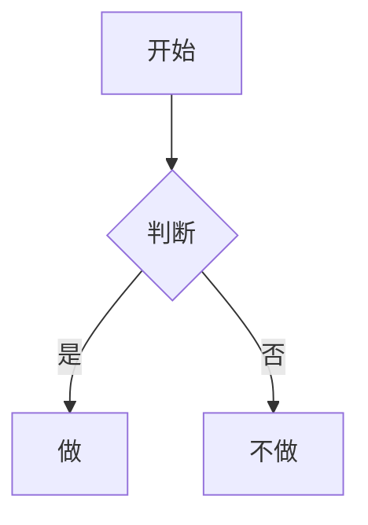

# Obsidian Flavored Markdown 语法要点

> Obsidian 扩展了 CommonMark/GFM：wikilink、嵌入、Callout、属性、注释、高亮等。
> 本文覆盖 Obsidian 特有扩展；标准 Markdown 不在此列。
> 完整语法以 Obsidian 官方文档（help.obsidian.md）为准。

## 属性（frontmatter / properties）

```yaml
---
title: 我的笔记
date: 2026-08-05
tags:
  - project
  - active
aliases:
  - 别名
status: pending
---
```

- 常用默认属性：`tags`（标签）、`aliases`（别名）、`cssclasses`（样式类）；
- 属性类型与高级用法见官方 Properties 文档；列表建议用行内数组
  （`tags: [a, b]`）规避 CLI 盘符陷阱。

## 内部链接（wikilink）

```markdown
[[笔记名]]                      链接笔记
[[笔记名|显示文字]]             自定义显示文字
[[笔记名#标题]]                 链接到标题
[[笔记名#^块id]]                链接到块
[[#本笔记内标题]]               同笔记标题链接
```

- vault 内笔记用 wikilink（重命名自动跟随）；外部 URL 用 `[文字](url)`。

## 嵌入（embeds）

```markdown
![[笔记名]]                     嵌入整篇
![[笔记名#标题]]                嵌入小节
![[图片.png]]                   嵌入图片
![[图片.png|300]]               指定宽度
```

## Callout

```markdown
> [!note]
> 提示内容。

> [!warning] 自定义标题
> 内容。

> [!faq]- 默认折叠
> 折叠 callout（`-` 折叠、`+` 展开）。
```

常用类型：`note` / `tip` / `warning` / `info` / `example` / `quote` / `bug` /
`danger` / `success` / `failure` / `question` / `abstract` / `todo`。

## 标签

```markdown
#标签                行内标签
#层级/标签           嵌套标签（层级）
```

标签可含字母、数字（不能开头）、下划线、连字符、斜杠；也可写在 frontmatter
`tags` 属性中。

## 注释

```markdown
可见内容 %%隐藏内容%% 可见内容
%%
整块注释在阅读视图隐藏
%%
```

## 其他 Obsidian 专属格式

```markdown
==高亮==                高亮
$e^{i\pi}+1=0$          行内数学（块级用 $$...$$）
[^1] 与 [^1]: 内容       脚注
```

## 代码块与 Mermaid

````markdown
```python
print("hi")
```


````

Mermaid 节点可加 `class 节点名 internal-link;` 链接到笔记。

## 任务列表

```markdown
- [ ] 未完成
- [x] 已完成
```
